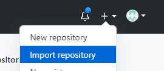
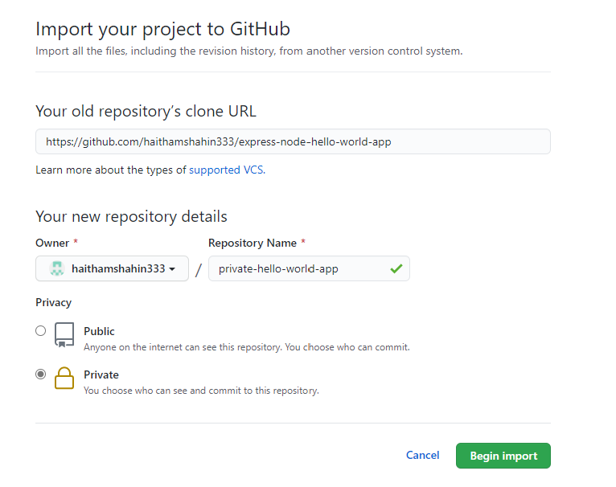
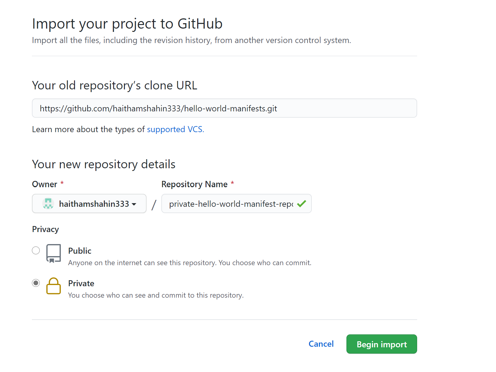
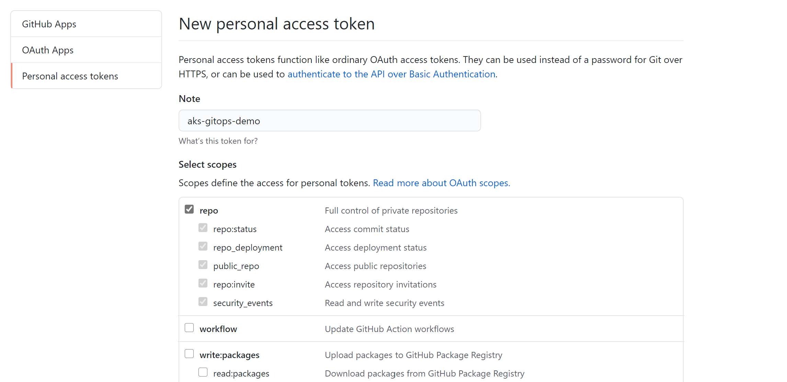
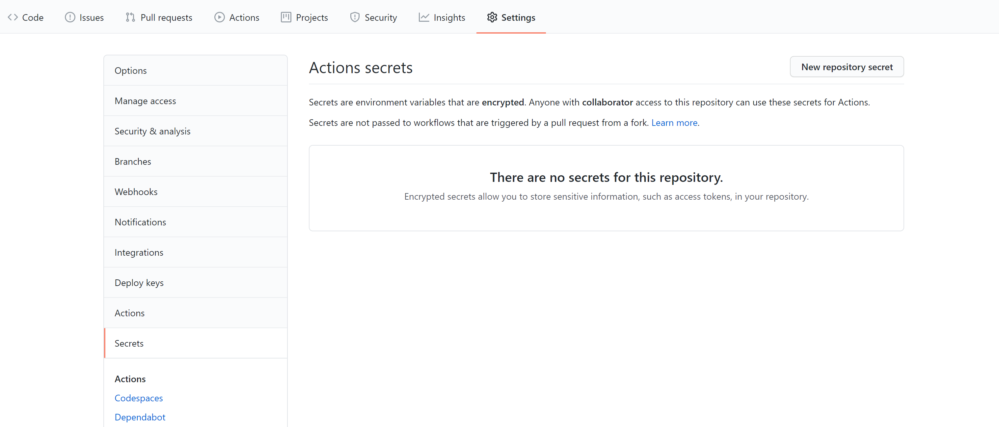
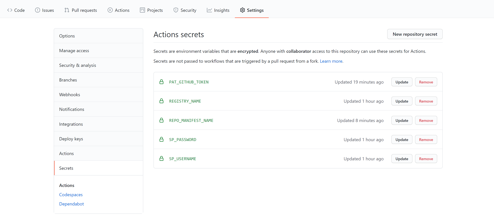
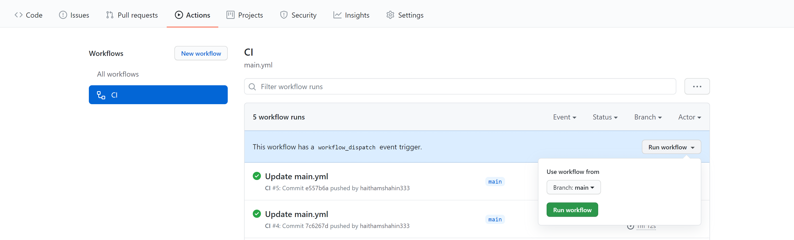
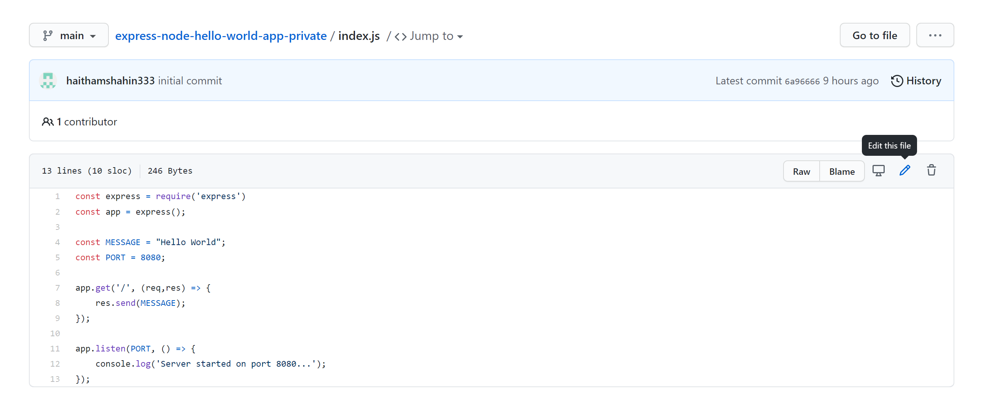
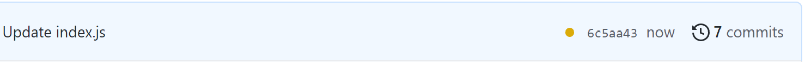

# GitOps Demo with Flux V2 on AKS

This repo has instructions for how to deploy a basic GitOps Workflow. The following diagram outlines what will be built and deployed:

This repo also functions as a manifest repo. In a GitOps CI/CD model, this repo acts as the single source of truth for everything that should be deployed in the cluster.

## Tools and Concepts

The following tools/concepts will be used in the demo:
- AKS
- ACR
- Flux v2
- Kustomize
- GitHub Actions

The focus on this demo will be about deploying a basic GitOps workflow, and therefore is not a production-ready deployment. The goal is to see how to implement GitOps in th context of a basic CI pipeline and understand the difference between the App Repo and the Manifest Repo.

## Pre-Requisites

- Azure Subscription (commercial) 
- [Azure CLI](https://docs.microsoft.com/en-us/cli/azure/install-azure-cli), v2.18 (or newer)
- [kubectl](https://kubernetes.io/docs/tasks/tools/), v1.18 (or newer)
- [Flux v2 CLI](https://github.com/fluxcd/flux2), v0.11 (or newer)

## Folders

1. `app-manifests` - this contains all the resources needed to deploy the [hello-world app](https://github.com/haithamshahin333/express-node-hello-world-app). As part of the Workflow for the hello-world app, a commit is made back to this folder using `kustomize edit set image` so that the folder points to the latest image.

2. `flux-demo` - collection of scripts needed to deploy aks and flux.

3. `argo-demo` - collection of scripts needed to deploy aks and argo.

## Deployment of AKS, Flux V2, and GitOps Workflow with Hello World App

> Prior to starting the instructions below, clone this repository locally and navigate to the `./flux-demo` directory. The majority of instructions will be executed assuming you are working out of that directory.

### Import the [Hello World App Repo](https://github.com/haithamshahin333/express-node-hello-world-app) into your own private repo for you to work through for this demo.

1. Select at the top right of the screen after logging in to GitHub the "Import Repository" button:

    

2. Copy the GitHub link `https://github.com/haithamshahin333/express-node-hello-world-app.git` into the import form and create a private repo with any name:

    

### Import this repo, known as the [Manifests Repo](https://github.com/haithamshahin333/hello-world-manifests.git), into your own private repo for you to work through for this demo.

1. Select at the top right of the screen after logging in the "Import Repository" button:

    

2. Copy the GitHub link `https://github.com/haithamshahin333/hello-world-manifests.git` into the import form and create a private repo with any name:

    

### Generate a Personal Access Token [PAT](https://docs.github.com/en/github/authenticating-to-github/creating-a-personal-access-token) to allow Flux and the GitHub Actions workflow to read/write from your personal private repositories.

1. Follow the steps here on [creating a token](https://docs.github.com/en/github/authenticating-to-github/creating-a-personal-access-token#creating-a-token).

2. Be sure to only select the repo scope for permissions:

    

3. Save the token in a local file for later use. Once the screen is refreshed, you will no longer be able to view the token value. If needed, you can always delete the old token and create a new one.

### Configure your environment - set and save the environment variables listed below to a `.env` file to personalize your deployment.

1. Run the command `touch .env` to create a .env file in the `./flux-demo` directory and fill in the following environment variables. These will be needed to deploy your AKS cluster and Flux.

    ```bash
    # Azure settings
    RG_NAME=                                            # Resource group name, ie: 'aks-argo-demo'
    LOCATION=eastus                                     # az account list-locations --query '[].name'

    # AKS/ACR settings
    AKS_NAME=                                           # AKS Cluster Name, ie: 'aks-argo-cluster'
    ACR_NAME=                                           # ACR instance name, ie: 'acrDemoRegistry' - make this unique by adding random nubmers and letters
    AKS_NODE_COUNT=3                                    # Node count for AKS Cluster
    SERVICE_PRINCIPAL_NAME=                             # Service Principal to be used for GitHub Actions to push images to ACR

    # Flux settings
    PAT_GITHUB_TOKEN=                                   # Token previously generated in GitHub (also known as PAT)
    GITHUB_USER=                                        # GitHub username
    REPO_MANIFEST_NAME=                                 # name of the private manifest repo (this is the repo name created in GitHub, example: private-hello-world-manifests)
    REPO_HTTPS_MANIFEST_URL=                            # https private repo url for the manifests repo (you can find this in the GitHub UI by selecting the Code button on your repo's home page and then selecting https. The URL should end in '.git')
    ```

### Deploy an AKS Cluster in Azure alongside an ACR instance

1. Run `az login` to login to Azure.

2. Run the following commands from the `./flux-demo` folder where your `.env` file should be located:

    ```bash
    set -a  
    source .env
    set +a
    ```

3. Deploy the AKS Cluster by running `./deploy-aks.sh`.

    > Once this script completes, validate in the Azure Portal that the AKS cluster has been provisioned. You can also run `kubectl get nodes` and confirm that you see agents running.

    > If you get errors due to naming issues, delete the resource group and re-run the script. To delete the resource group, run `az group delete --resource-group $RG_NAME -y`.

### Setup GitHub Actions Workflow and seed the ACR instance with a container image

1. Go to your private app repo and select 'settings' and then the 'secrets' tab:

    

2. Add the following secrets. These will be used from your GitHub actions workflow:

    - `REPO_MANIFEST_NAME`: This is your private manifest repo org/name (example: haithamshahin333/hello-world-manifests-private)
    - `PAT_GITHUB_TOKEN`: This the GitHub Token (also known as the PAT)
    - `REGISTRY_NAME`: This is ACR name in all lowercase (run `echo $ACR_NAME | tr '[:upper:]' '[:lower:]'` to get the value)
    - `SP_USERNAME`: This is the ID of the service prinicpal (run `az ad sp show --id http://$SERVICE_PRINCIPAL_NAME --query appId --output tsv` to get the value - check your .env for the service principal name)
    - `SP_PASSWORD`: this is the password for the service principal (run `echo $SP_PASSWD` to get the value). If you are unable to get the password value from `$SP_PASSWD`, then run the following command to generate a new password for the service principal: `az ad sp credential reset --name http://$SERVICE_PRINCIPAL_NAME`.

    

3. Run the workflow manually to push an image to your ACR instance by clicking 'Actions', then 'CI', and then 'Run worklow' on branch main:

    

    > Once this workflow completes, validate in the Azure Portal that there is a hello-world repository in your ACR instance.

### Deploy Flux to your AKS Cluster

1. Set your environment with your .env variables as you did previously by running the commands below from the `./flux-demo` directory:

    ```bash
    # Source and export the environment variables
    set -a  
    source .env    
    set +a
    ```

2. Run the `./deploy-flux.sh` script (assumes that kubectl is still set since you deployed your aks cluster previously).

### View Flux Sync

1. Watch Flux sync the app manifests.

    ```bash
    # Watch flux sync the changes
    watch flux get kustomizations
    ```

2. View the deployed hello-world app by running the following command to get the External-IP:

    ```bash
    kubectl get svc/hello-world -n hello-world
    ```

### Update the Hello-World App and Watch Your CI/CD Workflow with GitOps!

1. Navigate to your private hello-world app repo. We wil make a commit directly from the GitHub UI.

2. Click on `index.js` and then select the pencil icon to edit the file directly from the UI:

    

3. Update the `MESSAGE` variable to `"Hello World with GitOps!"` and scroll down and select 'Commit changes'.

4. You should now see an orange circle next to the commit hash, indicating that the GitHub actions workflow is running. This workflow will build the container image and then make a commit directly to your private manifest repo to update the app-manifests to point to the newest version of the image pushed to ACR:

    

5. If all works, that indicator will become a green checkmark. From there, Flux within the next few minutes will sync the changes automatically to the cluster, which will deploy the new version of the hello-world image. Refresh the Hello World IP to view the changes.

## Tear Down Deployment

### Delete all resources provisioned in Azure

1. Delete the Service Principal that the GitHub Actions workflow used to push images to ACR:

    ```bash
    az ad sp delete --id http://$SERVICE_PRINCIPAL_NAME    #this will be the value you put in your .env file for the service principal
    ```

2. Delete the Resource Group which holds all your Azure Resources:

    ```bash
    az group delete --resource-group $RG_NAME -y
    ```

    > Go to the Azure Portal, select Resource Groups, and validate that you do not see the `$RG_NAME` resource group or a resource group that starts with `MC_*` (this is the resource group that Azure uses to provision the resources needed for the AKS cluster). You may also see a `NetworkWatcherRG` Resource Group - you can delete this one as well if this is not one you need or created before this demo.

3. Delete the GitHub Token/PAT that was generated by navigating to where you created it previously in the GitHub UI. You should see the Delete button next to the token.

4. Delete the two private repos you made for this exercise if you no longer need them.